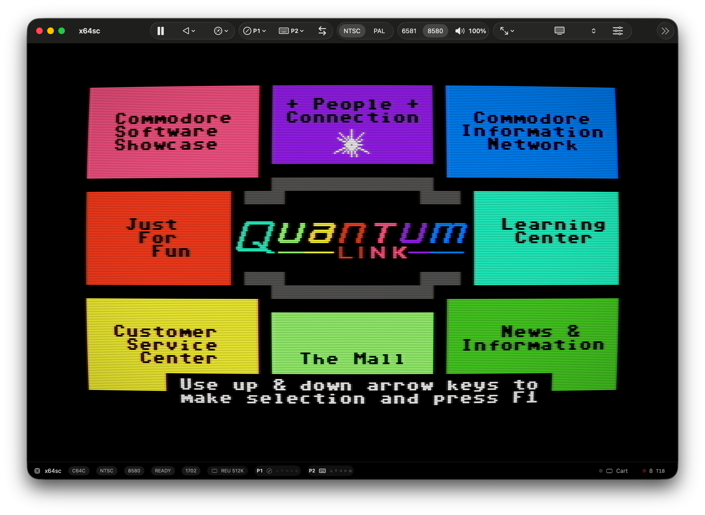
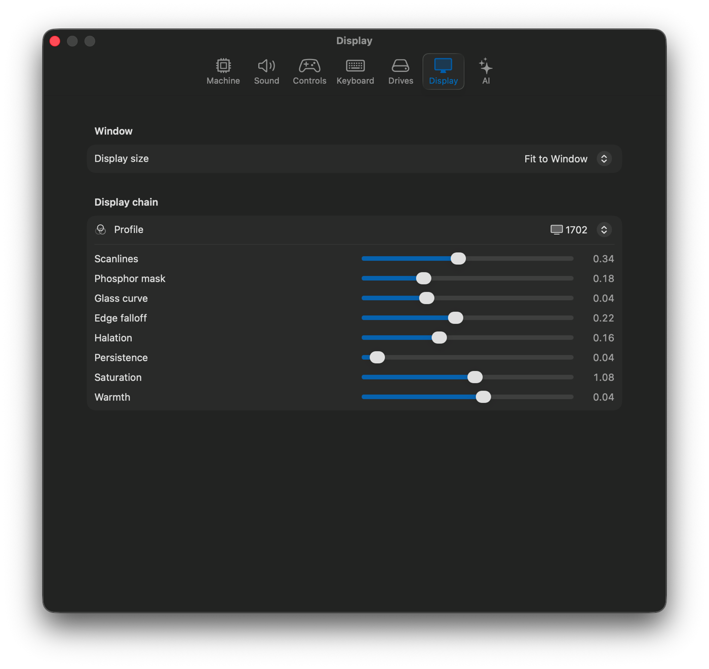
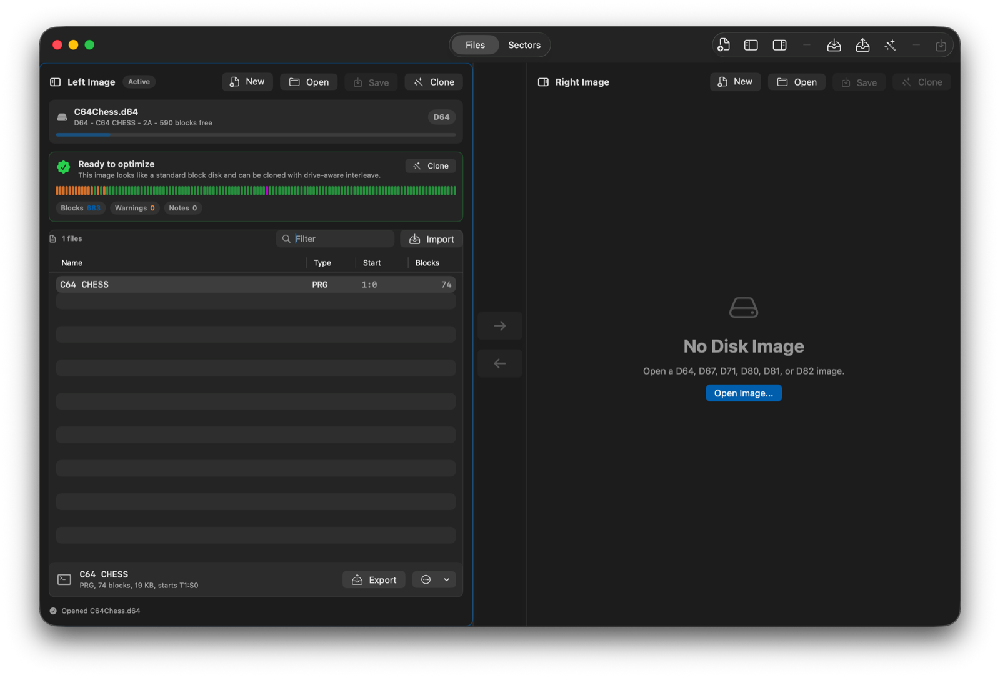

<p align="center">
  
</p>

<h1 align="center">VICE Mac</h1>

<p align="center">
  <strong>VICE underneath. Native Mac on top.</strong><br>
  Apple Silicon Commodore emulation with SwiftUI, Metal, signed releases, a real media library, Q-Link Reloaded support, and MacVICEKit for developers.
</p>

<p align="center">
  <a href="https://github.com/barryw/vice-macos/releases/latest"></a>
  <a href="https://ci.barrywalker.io/repos/barryw/vice-macos"></a>
  
  <a href="https://github.com/barryw/vice-macos/releases/latest/download/coverage.json"></a>
</p>

<p align="center">
  <a href="https://github.com/barryw/vice-macos/releases/latest">Download</a>
  ·
  <a href="https://macvice.com/">Website</a>
  ·
  <a href="https://macvice.com/macvicekit.html">MacVICEKit</a>
  ·
  <a href="https://macvice.com/docs/macvicekit/documentation/macvicekit/">API Docs</a>
  ·
  <a href="https://github.com/barryw/vice-macos/releases/latest/download/appcast.xml">Sparkle Appcast</a>
</p>

<p align="center">
  
</p>

## What It Is

VICE Mac is the Mac-native front end VICE deserved.

It keeps the real VICE emulation core and replaces the desktop experience with
native macOS apps: SwiftUI windows, AppKit integration where it matters, Metal
video output, native menus and toolbars, signed/notarized DMG releases, Sparkle
updates, a media library, a disk image manager, Q-Link Reloaded setup, and a
reusable Swift package for building other tools on top of VICE.

No X11. No GTK shell. No generic Linux UI pretending to be a Mac app.

## Download

Grab the latest notarized Apple Silicon DMG:

**https://github.com/barryw/vice-macos/releases/latest**

The release contains separate apps for each supported machine. Drag the apps
you want into `/Applications`.

## At A Glance

| Area | What You Get |
|---|---|
| Display | Native Metal renderer with LCD, CRT, PVM, RF, scanline, mask, curvature, halation, persistence, saturation, and warmth controls |
| Media | Stable media library for disks, programs, tapes, cartridges, snapshots, favorites, search, directory inspection, and quick launch |
| Disk tools | Native D64/D67/D71/D80/D81/D82 image manager with file import/export, BAM/sector inspection, GEOS helpers, and explicit save control |
| Controllers | Per-device keyboard, joystick, game controller, and 1351 mouse mapping with USB controller identification |
| Networking | User Port, SwiftLink, and Turbo232 modem support where VICE supports it, plus Q-Link Reloaded helper flows |
| Developer SDK | MacVICEKit Swift package with engine sessions, Metal display, audio/video sources, input routing, media helpers, snapshots, and debugger APIs |
| Updates | Sparkle appcast backed by GitHub Releases |
| Release quality | CI-built, signed, notarized, stapled, smoke-tested DMGs with checksums |

## Included Apps

| App | Machine |
|---|---|
| `x64sc.app` | Commodore 64, cycle-exact |
| `xvic.app` | VIC-20 |
| `xpet.app` | PET |
| `xplus4.app` | Plus/4 |
| `xc16.app` | C16 |
| `xc232.app` | C232 |
| `xv364.app` | V364 |
| `x128.app` | C128 |
| `vsid.app` | SID player |

## Highlights

### Native Metal Display

The emulator frame buffer is rendered through Metal with display presets for a
clean LCD view, Commodore 1702/1084-style CRTs, PVM, RF, and green, amber, or
white phosphor displays. Scanlines, mask intensity, curvature, halation,
persistence, saturation, and warmth are adjustable per machine.

<p align="center">
  
</p>

### Media Library

Import disks, programs, tapes, cartridges, and snapshots into a stable library
location. Search them, favorite them, inspect disk directories, and run, load,
or attach without hunting through folders every time.

### Disk Image Manager

Open D64, D67, D71, D80, D81, and D82 images. Create blank images, inspect
directories and sectors, import PRGs, export files, rename entries, delete
entries, clone optimized rebuilt images, and make explicit saves when you are
ready to write changes.

<p align="center">
  
</p>

### Q-Link Reloaded

VICE Mac can help configure a user-supplied Q-Link disk for Q-Link Reloaded,
validate compatible modem settings, capture protocol traffic, and manage saved
profiles through Keychain-backed storage.

### Machine-Aware Settings

Each app boots with the right machine model, ROM slots, drive defaults, video
standard choices, SID options where supported, and machine-specific settings.
The UI exposes C64, C128, VIC-20, PET, and Plus/4-family differences without
forcing everything through a generic emulator panel.

### GEOS And Tiny Commodore Utilities

The repo includes `commodore-utils/geos-rtc`, a tiny GEOS auto-exec driver for
C64 and C128 GEOS that reads VICE's DS1307 userport RTC and sets GEOS date/time
during boot.

Build the utility payload with:

```sh
make -C commodore-utils/geos-rtc
```

### Optional AI Assistant

The app includes an optional assistant panel that can use local Foundation
Models where available or an OpenAI-compatible provider. The assistant talks to
the emulator through the app's internal tool surface, so it can inspect state
and batch machine changes instead of pretending it changed something.

## MacVICEKit

MacVICEKit is the reusable Swift package behind the app. It packages the VICE
runtime bridge, Metal display, audio/video sources, input forwarding, media
attachment, snapshots, and debugger APIs so other macOS tools can embed VICE
without copying app internals.

Release builds publish a self-contained SDK artifact:

```text
MacVICEKit-<version>-arm64.zip
```

The package includes Swift APIs, the C bridge, a signed
`MacVICERuntime.xcframework`, bundled runtime dependencies, `VICEData`, and a
manifest.

Read more:

- [MacVICEKit product page](https://macvice.com/macvicekit.html)
- [MacVICEKit API docs](https://macvice.com/docs/macvicekit/documentation/macvicekit/)
- [MacVICEKit README](MacVICEKit/README.md)

## Building

Open the Xcode project:

```sh
open macos/ViceMac.xcodeproj
```

Build a machine from the command line:

```sh
xcodebuild \
  -project macos/ViceMac.xcodeproj \
  -scheme "VICE Mac C64" \
  -configuration Debug \
  -destination 'platform=macOS,arch=arm64' \
  -derivedDataPath /private/tmp/vice-macos-derived-data \
  build
```

Run the native test suite:

```sh
xcodebuild test \
  -project macos/ViceMac.xcodeproj \
  -scheme "VICE Mac Tests" \
  -configuration Debug \
  -destination 'platform=macOS,arch=arm64' \
  -derivedDataPath /private/tmp/vice-macos-tests
```

Build the release DMG:

```sh
macos/scripts/package-vicemac-release.sh
```

Build only the reusable MacVICEKit SDK artifact:

```sh
macos/scripts/package-macvicekit-runtime.sh
```

Current Xcode releases require Apple's separate Metal toolchain component:

```sh
xcodebuild -downloadComponent MetalToolchain
```

The release script auto-detects the installed Metal toolchain. Set
`VICE_MAC_XCODE_TOOLCHAIN` to force a toolchain, or set
`VICE_MAC_AUTO_METAL_TOOLCHAIN=0` to use Xcode's default behavior.

## Signing And Notarization

For a local signed release:

```sh
VICE_MAC_CODESIGN_IDENTITY="Developer ID Application: Your Name (TEAMID)" \
VICE_MAC_DEVELOPMENT_TEAM="TEAMID" \
VICE_MAC_NOTARYTOOL_PROFILE="vice-mac-notary" \
macos/scripts/package-vicemac-release.sh
```

Create the notary profile once on the signing machine:

```sh
xcrun notarytool store-credentials vice-mac-notary \
  --apple-id you@example.com \
  --team-id TEAMID \
  --password APP_SPECIFIC_PASSWORD
```

When notarization is enabled, the script signs all app bundles, re-signs
Sparkle's nested updater helpers, signs the DMG, submits it to Apple, staples
the ticket, validates the staple, and writes `SHA256SUMS.txt`.

## Release Flow

The Woodpecker `metal-ui` pipeline runs on pushes to `main` that touch the
native Mac app, VICE bridge, packaging, or MacVICEKit sources. Release tags do
not trigger a second release build.

On a green push, CI:

1. Prepares the VICE tree and Metal toolchain.
2. Builds and tests the native Mac apps.
3. Packages all machine apps into one Apple Silicon DMG.
4. Builds the reusable MacVICEKit SDK artifact with `MacVICERuntime.xcframework`.
5. Signs, notarizes, staples, and smoke-tests the DMG.
6. Publishes a GitHub Release named `vice-mac-<VICE version>-<git sha>-1`.
7. Uploads the DMG, MacVICEKit SDK zip, `SHA256SUMS.txt`, `coverage.json`,
   and `appcast.xml`.
8. Deploys the website after GitHub's latest release endpoint points at that
   release.

Required Woodpecker secrets:

- `github_token`
- `sparkle_private_key`
- `apple_codesign_identity`
- `apple_development_team`
- `apple_notarytool_profile`

## Upstream VICE

This work builds on VICE, the canonical multi-platform Commodore emulator:

https://vice-emu.sourceforge.io/

This repository tracks VICE upstream directly. Local product work lives on
`main`; `git pull` merges `VICE-Team/svn-mirror` `main`, and `git push` pushes
this Mac product repo.

## Credits

VICE Mac exists because the VICE team did the hard emulator work first. This
project adds the native macOS application layer, packaging, MacVICEKit, website,
and Mac-specific workflow on top of that foundation.
